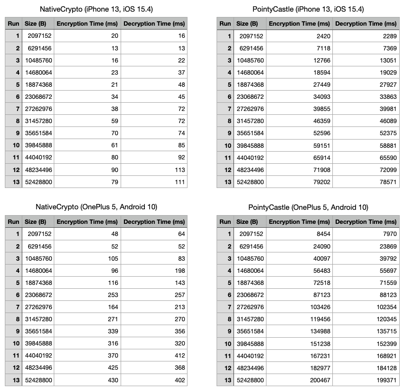

/*
 * Copyright 2019-2023 Hugo Pointcheval
 * 
 * Use of this source code is governed by an MIT-style
 * license that can be found in the LICENSE file or at
 * https://opensource.org/licenses/MIT.
 */
<p align="center">

<h5 align="center">Fast and powerful cryptographic functions for Flutter.</h5>
</p>

<p align="center">
<a href="https://git.wyatt-studio.fr/Wyatt-FOSS/wyatt-packages/src/branch/master/packages/wyatt_analysis">

</a>

<a href="https://github.com/invertase/melos">

</a>

<a href="https://drone.wyatt-studio.fr/hugo/native-crypto">

</a>
</p>

---

[[Changelog]](./CHANGELOG.md) | [[License]](./LICENSE)

---

## About

The goal of this plugin is to provide a fast and powerful cryptographic functions by calling native libraries. On Android, it uses [javax.cypto](https://developer.android.com/reference/javax/crypto/package-summary), and on iOS, it uses [CommonCrypto](https://opensource.apple.com/source/CommonCrypto/) and [CryptoKit](https://developer.apple.com/documentation/cryptokit/)

I started this projet because I wanted to add cryptographic functions on a Flutter app. But I faced a problem with the well-known [Pointy Castle](https://pub.dev/packages/pointycastle) library: the performance was very poor. Here some benchmarks and comparison:



For comparison, on a *iPhone 13*, you can encrypt/decrypt a message of **2MiB** in **~5.6s** with PointyCastle and in **~40ms** with NativeCrypto. And on an *OnePlus 5*, you can encrypt/decrypt a message of **50MiB** in **~6min30** with PointyCastle and in less than **~1s** with NativeCrypto.

In short, NativeCrypto is incomparable with PointyCastle.

## Usage

First, check compatibility with your targets.

| iOS | Android | MacOS | Linux | Windows | Web |
| --- | ------- | ----- | ----- | ------- | --- |
| ✅  | ✅      | ❌     | ❌     | ❌      | ❌  |

#### Hash

To digest a message, you can use the following function:

```dart
Uint8List hash = await HashAlgorithm.sha256.digest(message);
```

> In NativeCrypto, you can use the following hash functions: SHA-256, SHA-384, SHA-512

#### Keys

You can build a `SecretKey` from a utf8, base64, base16 (hex) strings or raw bytes. You can also generate a SecretKey from secure random.

```dart
SecretKey secretKey = SecretKey(Uint8List.fromList([0x73, 0x65, 0x63, 0x72, 0x65, 0x74]));
SecretKey secretKey = SecretKey.fromUtf8('secret');
SecretKey secretKey = SecretKey.fromBase64('c2VjcmV0');
SecretKey secretKey = SecretKey.fromBase16('63657274');
SecretKey secretKey = await SecretKey.fromSecureRandom(256);
```

#### Key derivation

You can derive a `SecretKey` using **PBKDF2**.

First, you need to initialize a `Pbkdf2` object.

```dart
Pbkdf2 pbkdf2 = Pbkdf2(
    keyBytesCount: 32,
    iterations: 1000,
    algorithm: HashAlgorithm.sha512,
);
```

Then, you can derive a `SecretKey` from a password and salt.

```dart
SecretKey secretKey = await pbkdf2.derive(password: password, salt: 'salt');
```

> In NativeCrypto, you can use the following key derivation function: PBKDF2

#### Cipher

And now, you can use the `SecretKey` to encrypt/decrypt a message.

First, you need to initialize a `Cipher` object.

```dart
AES cipher = AES(secretKey);
```

Then, you can encrypt your message.

```dart
CipherTextWrapper wrapper = await cipher.encrypt(message);

CipherText cipherText = wrapper.unwrap<CipherText>();
// same as
CipherText cipherText = wrapper.single;

// or

List<CipherText> cipherTexts = wrapper.unwrap<List<CipherText>>();
// same as
List<CipherText> cipherTexts = wrapper.list;
```

After an encryption you obtain a `CipherTextWrapper` which contains `CipherText` or `List<CipherText>` depending on the message size. It's up to you to know how to unwrap the `CipherTextWrapper` depending the chunk size you configured.

Uppon receiving encrypted message, you can decrypt it.
You have to reconstruct the wrapper before decrypting.

```dart
CipherTextWrapper wrapper = CipherTextWrapper.fromBytes(
    data,
    ivLength: AESMode.gcm.ivLength,
    tagLength: AESMode.gcm.tagLength,
);
```

Then, you can decrypt your message.

```dart
Uint8List message = await cipher.decrypt(wrapper);
```

## Development

### Android

> https://docs.flutter.dev/development/packages-and-plugins/developing-packages#step-2b-add-android-platform-code-ktjava

* Launch Android Studio.
* Select Open an existing Android Studio Project in the Welcome to Android Studio dialog, or select File > Open from the menu, and select the `packages/native_crypto/example/android/build.gradle` file.
* In the Gradle Sync dialog, select OK.
* In the Android Gradle Plugin Update dialog, select Don’t remind me again for this project.

### iOS

> https://docs.flutter.dev/development/packages-and-plugins/developing-packages#step-2c-add-ios-platform-code-swifthm

* Launch Xcode.
* Select File > Open, and select the `packages/native_crypto/example/ios/Runner.xcworkspace` file.
